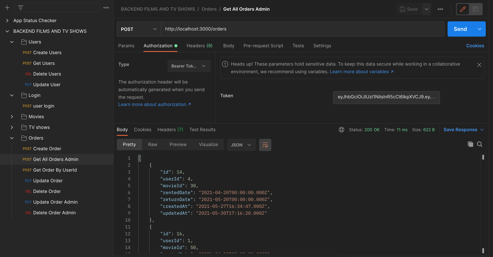

<h1 align="center">
   🎥 Backend Buscador Películas 🎥
</h1>

---

Reto del Bootcamp FullStack Developer con <a href="https://geekshubsacademy.com/">GeeksHubs Academy</a> en el que nos piden recrear la parte backend para una aplicación de alquiler de películas.

El siguiente proyecto está realizado por [Guillermo Raez](https://github.com/GuillermoRaez) y [Adriana Fayos](https://github.com/AdrianaFayos). 

Fecha de inicio 19 de Mayo.  
Fecha máxima de entrega 30 de Mayo.

Hemos utilizado la herramienta Trello para organizar y distribuir las tareas.

## Instrucciones 🔧

Para empezar clonar el repositorio e instalar las dependencias del proyecto.

### `npm i`

Inicializar la dependencia Sequelize e introducir los campos de contraseña y base de datos en el archivo config.json.

### `sequelize init`

Migrar los modelos a la base de datos local.

### `sequelize db:migrate`

Levantar el servidor. 

### `npm start`

Finalmente en Postman enviar petición de los endpoints.

## Endpoints

- Películas 
   - GET /movies/toprated --> Muestra películas top rated.
   - GET /movies/searchid/:id --> Muestra películas según su id.
   - GET /movies/search/:title --> Muestra películas por título.
   - GET /movies/genre/:name --> Muestra películas con determinado género.
   - GET /movies/actors/:name --> Muestra películas por actores.

 

- Series
   - GET /tvshows/toprated --> Muestra series top rated.
   - GET /tvshows/searchid/:id --> Muestra series según su id.
   - GET /tvshows/search/:title --> Muestra series por título.
   - GET /tvshows/ontheair --> Muestra series que vayan a tener un capítulo emitido en los próximos 7 dias.
   - GET /tvshows/theatre_or_cinema/:id --> Muestra series que vayan a tener un pase en teatros o cines.
 

- Login de usuario
   - POST /login --> Logea a un usuario registrado y devuelve un token.
 

- Usuarios
   - GET /users --> Muestra los usuarios registrados (token admin necesario).
   - POST /users --> Da de alta un nuevo usuario y encripta su contraseña.
   - PUT /users --> Modifica los atributos de un usuario (token login necesario).
   - DELETE /users --> Elimina el usuario introducido mediante id (token login necesario). 
 

- Pedidos
   - GET /orders --> Muestra todos los pedidos (token admin necesario).
   - GET /orders/findbyid --> Muestra todos los pedidos según el id de usuario (token login necesario).
   - POST /orders --> Crea un nuevo pedido (token login necesario).
   - PUT /orders --> Modifica los atributos de un pedido (token login necesario).
   - DELETE /orders --> Elimina un pedido (token login necesario). 
   - PUT /orders/admin --> Permite al administrador modificar los atributos de un pedido (token admin necesario).
   - DELETE /orders/admin --> Permite al administrador eliminar un pedido (token admin necesario). 

## Relación entre modelos

La relación entre los modelos usuario y pedidos es de 1 a muchos.

Un usuario puede realizar varios pedidos, pero un pedido solo puede ser ordenado por un usuario.

## Tecnologías utilizadas 

   

Dependencias instaladas : Express, Axios, MySQL2, Sequelize, Sequelize-cli, Bcrypt y Jsonwebtoken.

## Desarrolladores ✍️

[Guillermo Raez](https://github.com/GuillermoRaez) 
[Adriana Fayos](https://github.com/AdrianaFayos)

---