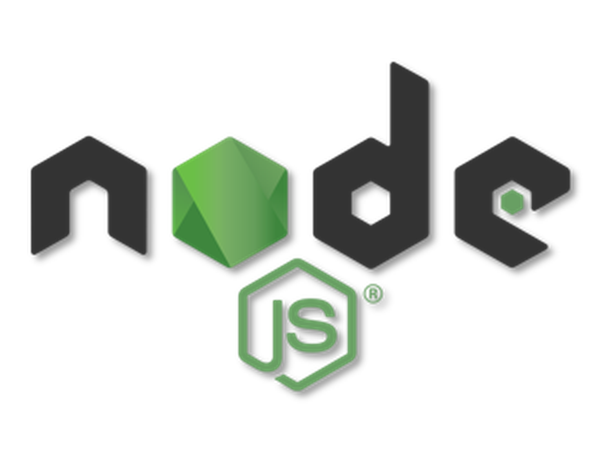

<h1 align="center">
   🎥 Backend Movie Finder 🎥
</h1>

---

Challenge from the Fullstack Developer Bootcamp at <a href="https://geekshubsacademy.com/">GeeksHubs Academy</a> where we have to recreate the backend of a rental movie application.

This Project has been done by [Guillermo Raez](https://github.com/GuillermoRaez) and [Adriana Fayos](https://github.com/AdrianaFayos).

Starting date: May 19th 2021.  
Due date: May 30th 2021.

We have used the Trello tool in order to share the tasks and to have a better organization.

## Instructions 🔧

The first step is to clone the repository and install the project dependencies in your local repository.

### `npm i`

Initializate the Sequelize dependency and fill in the password and database fields in the config.json file.

### `sequelize init`

Migrate the models to the local database.

### `sequelize db:migrate`

Run the server.

### `npm start`

Finally, enter the endpoints petitions in Postman and send them.

## Endpoints

- Movies
   - GET /movies/toprated --> Shows the Top Rated Movies.
   - GET /movies/searchid/:id --> Shows Movies by their id.
   - GET /movies/search/:title --> Shows Movies by title.
   - GET /movies/genre/:name --> Shows Movies by genre.
   - GET /movies/actors/:name --> Shows Movies by cast members.

 

- TVShows
   - GET /tvshows/toprated --> Shows the Top Rated TVShows.
   - GET /tvshows/searchid/:id --> Shows TVShows by their id.
   - GET /tvshows/search/:title --> Shows TVShows by title.
   - GET /tvshows/ontheair --> Shows TVShows that will have a new episode broadcasted in the next 7 days.
   - GET /tvshows/theatre_or_cinema/:id --> Shows TVShows that will come out in Theaters. 
 

- User Login
   - POST /login --> While login a registered user a token will be returned.
 

- Users
   - GET /users --> Shows the registered users (token admin needed).
   - POST /users --> Generates a new user and encrypts its password.
   - PUT /users --> Modify the users attributes (token login needed).
   - DELETE /users --> Delete the user by id (token login needed). 
 

- Orders
   - GET /orders -->  Shows all the orders (token admin needed).
   - GET /orders/findbyid --> Shows all the orders by the userId (token login needed).
   - POST /orders --> Creates a new order (token login needed).
   - PUT /orders --> Modify the order attributes (token login needed).
   - DELETE /orders --> Deletes an order (token login needed). 
   - PUT /orders/admin --> Allows the admin to modify the order attributes (token admin needed).
   - DELETE /orders/admin --> Allows the admin to delete an order (token admin needed). 

## Models relation

The relation between users and orders models is 1 to many (1:n).

A user can make unlimited orders, but an order can only be made by only one user.

## Used technologies

   

Installed dependencies: Express, Axios, MySQL2, Sequelize, Sequelize-cli, Bcrypt and Jsonwebtoken.

## Developers ✍️

[Guillermo Raez](https://github.com/GuillermoRaez) 
[Adriana Fayos](https://github.com/AdrianaFayos)

---